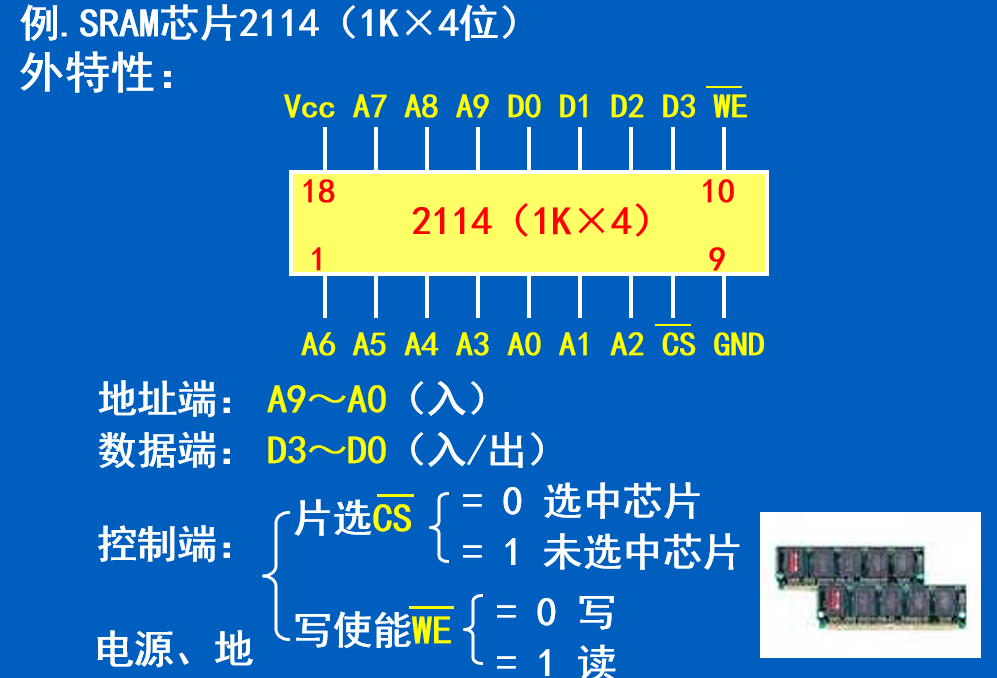
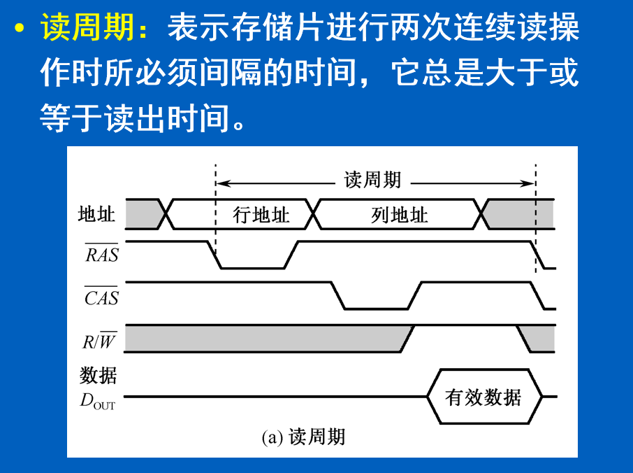
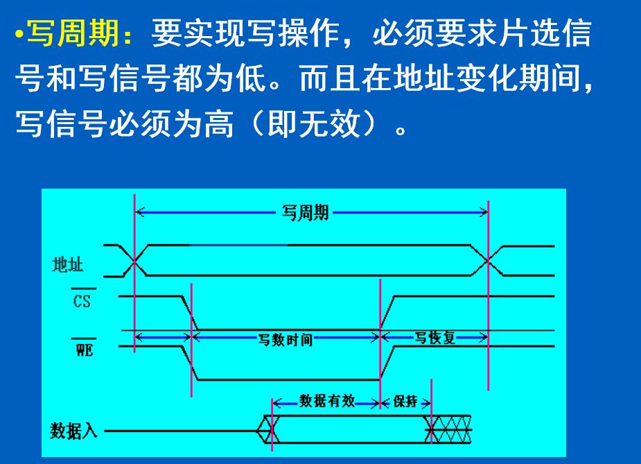
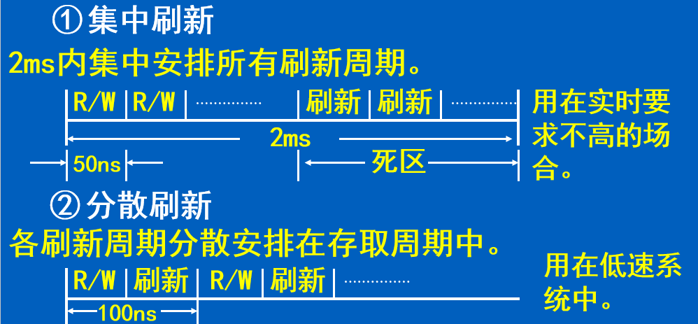
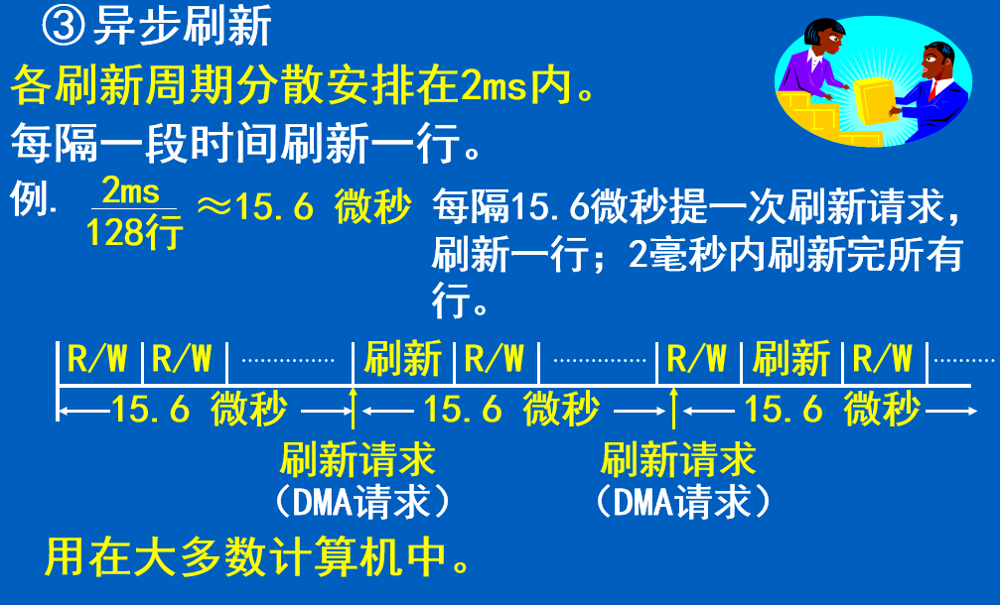
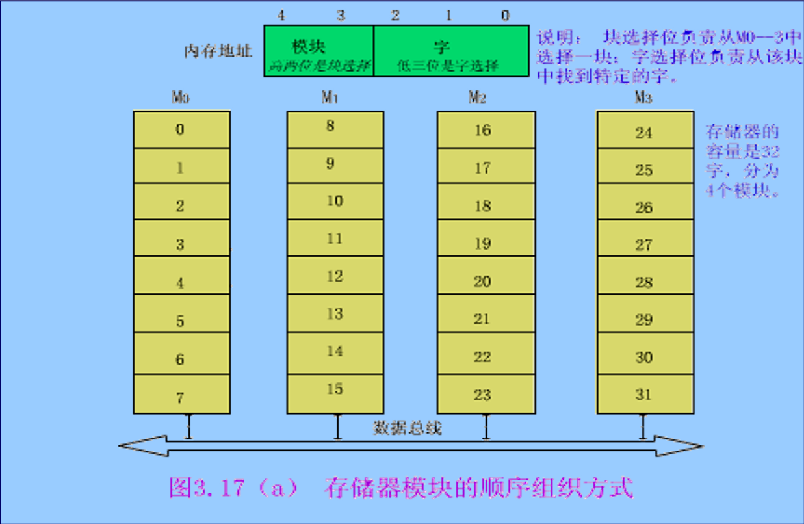
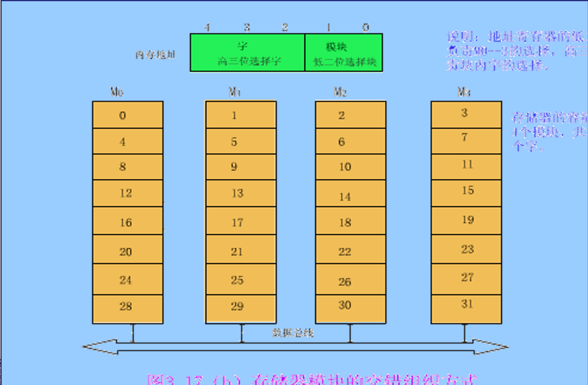
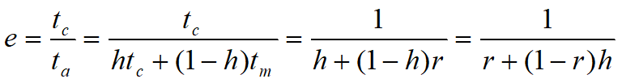

# 存储器的分类
1. 按存储器在系统中的作用分类
   1. 主存（内存）：主要存放CPU当前使用的程序和数据。**速度快，容量有限**
   2. 辅存（外存）：存放大量的后备程序和数据。 **速度较慢，容量大**
   3. 高速缓存：存放大量的后备程序和数据。**速度很快，容量小**
2. 按存取方式分：
   1. 随机存取存储器：可按地址访问存储器中的任一单元，访问时间与单元地址无关。
      1. RAM（可读可写）
      2. ROM（只读不写）
   2. 顺序存取存储器（SAM）：访问时读/写部件按顺序查找目标地址，访问时间与数据位置有关。
   3. 直接存取存储器（DAM）：访问时读/写部件先直接指向一个小区域，再在该区域内顺序查找。访问时间与数据位置有关。

> 存储器的技术指标：
> 1. 存储容量:指一个存储器中可以容纳的存储单元总数。
> 2. 存取时间：存储器访问时间。
> 3. 存储周期：连续启动两次读操作所需间隔的最小时间。
> 4. 存储器带宽：单位时间里存储器所存取的信息量。

# 随机读写存储器（RAM）

## 读周期

> 先输入行号，列号，然后时读信号，最后是输出有效数字

## 写周期

> cs 片选信号选中，WE信号允许写，随后输入数据写入

## 动态刷新

**定期向电容补充电荷 -- 刷新**

1. 刷新与重写的区别：
   1. **非破坏性读出**的动态M，需补充电荷以保持原来的信息。
   2. **破坏性读出**后重写，以恢复原来的信息。

2. 刷新方式：按行读

3. 最大刷新间隔：$$2$$ ms

4. 对主存的访问：
   CPU 访存：由CPU提供行、列地址，随机访问
   动态芯片刷新：由刷新地址计数器提供行地址，定时刷新

5. 刷新周期的安排方式

   

## 只读存储器

只读存储器简称**ROM**，它**只能读出，不能写入**。

 优点是：不易失性。

## 闪速存储器（闪存）

特点：

1. 固有的非易失性
2.  廉价的高密度
3. 可直接执行
4. 固态性能

## 双端口存储器

> 是指同一个存储器具有两组相互独立的读写控制线路，是一种高速工作的存储器。
>
> 设置 BUSY 位控制读写冲突

# 存储器模块的顺序组织方式

 　　　　　　

# 存储器模块的交叉组织方式

$$τ$$为总线传送周期，为了实现流水线方式存取，应当满足$$T=mτ$$（$$m=T/τ$$称为交叉存取度），因为交叉存储器要求其模块数必须大于或等于m，以保证启动某模块后经$$mτ$$时间再次启动该模块时，它的上次存取操作已经完成。

  这样，连续读取$$m$$个字所需的时间为

​    $$t1=T+(m-1)τ$$​

# Cache存储器

Cache 命中率：$$N_c$$ 表示 Cache 完成存取的总次数，$$N_m$$ 表示主存完成存取的总次数，$$h$$ 表示命中率

$$h = \frac{N_c}{N_C + N_m}$$

$$t_c$$ 表示命中时的Cache访问时间，$$t_m$$ 表示未命中时的主存访问时间

Cache/主存系统 的平均访问时 $$t_a$$ 为

$$ta = h t_c + (1-h)t_m$$

## 访问效率

